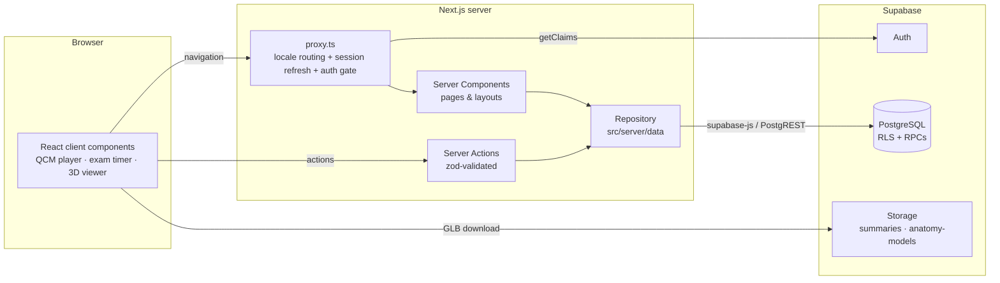
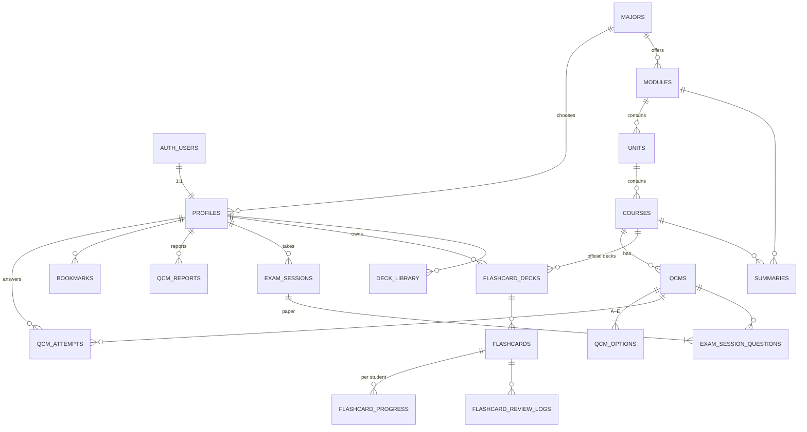

# Architecture — Nejma Med

Study platform for **L1 / L2** students in **Medicine, Dentistry (Chirurgie dentaire) and
Pharmacy** at the Faculty of Medicine, Mouloud Mammeri University of Tizi Ouzou (UMMTO).

> Status: phase 0–1 of the [roadmap](./ROADMAP.md) is implemented and tested (onboarding,
> dashboard, course QCMs, exam simulator, 3D anatomy, FR/EN). Flashcards and summaries have
> their full database design and SRS engine, their screens are next.

---

## 1. Stack and why

| Concern | Choice | Reason |
| --- | --- | --- |
| Web framework | **Next.js 16** (App Router, Server Components, Server Actions, `proxy.ts`) | Pages render on the server close to the data, and very little JS ships to students' phones. Mutations are plain async functions, so no separate API layer is needed. |
| Backend | **Supabase** (PostgreSQL + Auth + Storage + RLS) | The curriculum is deeply relational (major → year → module → unit → course → QCM) and analytics are SQL aggregates. Row Level Security and SQL functions let the **database** enforce who sees what and compute exam scores, so the client cannot cheat. Firestore would push that logic into client code or Cloud Functions. |
| Styling | **Tailwind CSS 4** with semantic tokens (`bg-card`, `text-primary`…) | Dark mode is just a swap of CSS variables. No UI kit dependency. |
| Animation | **Motion** (`motion/react`, the successor package of Framer Motion) | Onboarding transitions, feedback reveals, score ring. |
| Icons | **lucide-react**, plus a custom tooth icon | Explicit icon map keeps the bundle small. |
| i18n | **next-intl 4** with `/fr` and `/en` URL prefixes | Type-safe keys; the locale is read from `next/root-params`; ICU plurals. |
| 3D | **React Three Fiber 9 + drei** | Declarative scene, GLTF/Draco loading, `Bounds` camera framing, OrbitControls. |
| Spaced repetition | **ts-fsrs** (FSRS, the algorithm behind modern Anki) | Better retention per minute than Leitner/SM-2; review logs allow per-student tuning later. |
| Validation | **zod 4** | Every Server Action validates its input. |
| Tests | **Vitest** (unit) + real **PostgreSQL** (database) | The schema, RLS policies and RPCs run in CI against Postgres 16. |

---

## 2. System overview



* **Proxy** (`src/proxy.ts`): next-intl picks the locale (`/` → `/fr`). The Supabase session
  cookie is refreshed, and signed-out visitors are redirected to `/…/login` for app routes.
* **Layouts** enforce onboarding: the `(app)` shell calls `requireOnboardedProfile()`, which
  sends students without major/year to `/onboarding`.
* **Repository** (`src/server/data/repository.ts`): one interface, two implementations:
  * `supabase-repository.ts`: production.
  * `demo-repository.ts`: bundled sample content with in-memory state, used automatically
    when the Supabase env vars are missing, so `npm run dev` works immediately.

  Pages and actions call `getRepository()` and never know which one is active.

---

## 3. Directory structure

```
.
├── .github/workflows/ci.yml       Lint, typecheck, unit + DB tests, build
├── docs/                          ARCHITECTURE · ROADMAP · SETUP
├── messages/{fr,en}.json          UI translations (fr.json is the typed reference)
├── public/models/README.md        Where to get / how to prepare GLB anatomy models
├── scripts/
│   ├── build-seed-sql.ts          Renders the starter content as SQL
│   └── generate-seed.ts           npm run db:seed:generate → supabase/seed.sql
├── supabase/
│   ├── config.toml                Local Supabase (npx supabase start)
│   ├── migrations/…_initial_schema.sql
│   ├── seed.sql                   GENERATED starter curriculum + sample QCMs
│   └── tests/                     Schema tests + shim to run them on plain Postgres
└── src/
    ├── proxy.ts                   Locale routing, session refresh, auth gate
    ├── app/
    │   ├── [locale]/
    │   │   ├── layout.tsx         Root layout (html lang, fonts, NextIntlClientProvider)
    │   │   ├── page.tsx           Landing
    │   │   ├── (auth)/login, register
    │   │   ├── onboarding/        Major + year wizard
    │   │   └── (app)/             Signed-in shell (header + onboarding gate)
    │   │       ├── dashboard/
    │   │       ├── modules/[moduleId]/
    │   │       ├── courses/[courseId]/     Course QCM practice
    │   │       ├── exam/ · exam/[sessionId]/  Exam setup · running exam / results
    │   │       └── anatomy/
    │   └── auth/confirm/route.ts  E-mail confirmation callback
    ├── components/
    │   ├── ui/                    Button, Card, Badge, ProgressBar, icons, logo
    │   ├── layout/                Header, nav, locale switcher, demo banner
    │   ├── onboarding/ dashboard/ qcm/ exam/ anatomy/ auth/
    ├── content/                   Starter curriculum + sample QCMs (source of seed.sql)
    ├── hooks/                     useCountdown, useStopwatch, useQcmHotkeys
    ├── i18n/                      routing, navigation, request config
    ├── lib/                       Pure, isomorphic, unit-tested logic
    │   ├── qcm/                   scoring, session reducer, balanced draw, exam config
    │   ├── srs/scheduler.ts       FSRS wrapper (DB row ⇄ ts-fsrs card)
    │   ├── supabase/              env detection, server client, proxy client
    │   └── utils/
    ├── server/                    Server-only code
    │   ├── actions/               Server Actions (auth, onboarding, qcm, exam)
    │   ├── data/                  Repository interface + Supabase / demo implementations
    │   └── session.ts             requireOnboardedProfile()
    └── types/domain.ts            Domain types shared by server and client
```

Rule of thumb: `lib/` is pure and testable, `server/` touches the database, and
`components/` renders. Client components never import from `server/data` (only types).

---

## 4. Data model

Requested entities and their tables:

| Entity | Table(s) |
| --- | --- |
| Users | `auth.users` (Supabase Auth) + `profiles` (major, year, role, locale) |
| Majors | `majors` (reference data: medicine, dentistry, pharmacy) |
| Modules | `modules` (per major × year; `is_integrated` marks L2 UEIs) → `units` |
| Courses | `courses` |
| QCMs | `qcms` + `qcm_options` (A–E propositions), `qcm_attempts`, `bookmarks`, `qcm_reports` |
| ExamSessions | `exam_sessions` + `exam_session_questions` |
| FlashcardDecks | `flashcard_decks` + `deck_library` (decks added from others) |
| Flashcards | `flashcards` + `flashcard_progress` (per-student FSRS state) + `flashcard_review_logs` |
| Summaries | `summaries` (PDF in Storage or Markdown body, moderated) |
| 3D models | `anatomy_models` (GLB URL, licence, mesh-name → FR/EN labels) |



### Design decisions

* **Curriculum hierarchy is generic.** For L1, `Anatomie` (module) → `Ostéologie` (unit) →
  `Membre supérieur` (course). For L2 medicine, the module is the integrated unit (UEI)
  `Appareil cardio-respiratoire`, the unit is the discipline (`Anatomie`, `Physiologie`),
  and the course is the lecture.
* **Denormalised `module_id`** on `courses` and `qcms`, kept consistent by composite foreign
  keys (`(unit_id, module_id) → units(id, module_id)`). Exam pools and per-module statistics
  are then single-table queries.
* **Options are keyed by label** (`qcm_options (qcm_id, label)`). The API speaks
  `['A','C']`, which is how students and the exams refer to propositions.
* **Deferred constraint trigger**: a *published* QCM always has 2–8 options, at least one of
  them correct, and exactly one if it is a QCS. Drafts can be incomplete.
* **Grading follows the Algerian scale**: every exam stores `score` (points) and `score_20`
  (mark out of 20).
* **FSRS fields mirror `ts-fsrs`** (`state, due, stability, difficulty, scheduled_days,
  learning_steps, reps, lapses, last_review`). The deprecated `elapsed_days` is derived,
  not stored. The immutable review log makes per-student parameter optimisation possible.
* **Bilingual reference content** uses `title_fr` / `title_en` columns. QCM content stays in
  French (`language` column for future English items).

---

## 5. Security model

1. **RLS on every table.** Students see their own profile, attempts, exams, bookmarks and
   progress. Published content is readable by every signed-in student, and the curriculum
   is public.
2. **Answer keys never leave the database early.** `qcm_options.is_correct`,
   `qcm_options.explanation` and `qcms.explanation` are *not granted* to API roles (column
   privileges). Two `SECURITY DEFINER` functions reveal them:
   * `answer_qcm(qcm, selected)`: practice mode. It logs the attempt and returns the
     correction for that one question.
   * `submit_exam(session, answers)`: scores the whole paper, then returns the correction.
3. **Scores are computed in SQL** (`private.qcm_score`). Tables holding scores cannot be
   written by API roles, so no client can forge a mark.
4. **The server owns exam time.** `expires_at` is stored at `start_exam`. Autosave
   (`save_exam_answer`) stops at expiry, and answers sent more than 30 s late are ignored
   (the session is marked `expired`). The client countdown corrects for the device clock
   using the server time sent with the page.
5. **Exams are drawn only from the student's own curriculum**, balanced round-robin across
   the chosen modules, then shuffled.
6. **Roles** (`student`, `contributor`, `moderator`, `admin`) live in `profiles.role`, which
   students cannot update (column grants). Contributors can draft questions, and only
   moderators can publish them (trigger `guard_moderated_status`). The same applies to
   summaries.
7. **Storage**: the `summaries` bucket is private. Uploads go to `<uid>/…`, and an object
   is readable by its owner, by staff, or by everyone once its summary is published. The
   `anatomy-models` bucket is public-read and staff-write.
8. **Server Actions validate everything with zod**, and `?next=` redirects are restricted
   to same-site paths.

All of the above is covered by `supabase/tests/schema.test.ts` (26 tests), which runs in CI.

---

## 6. Key flows

### Onboarding

`/register` → `auth.signUp` (metadata `display_name`, `locale`) → trigger
`handle_new_user` creates the profile → `/onboarding` (major → year → confirm) →
`completeOnboarding` action updates `profiles.major/study_year` (a trigger stamps
`onboarded_at`) → `/dashboard`, whose queries filter on that major/year.

### Course practice (instant feedback)

```
PracticeSession (client)
  toggle A–E (useReducer: qcmSessionReducer)
  Valider → answerQcmAction → repo.answerQuestion → rpc answer_qcm
          ← { is_correct, score, correct[], explanation, option_explanations }
  → FeedbackPanel + per-option explanations, locked answer, next question
```

Keyboard: `A–E` tick, `Enter` validate / next, `←/→` navigate.

### Exam simulator

```
/exam (setup) ─ startExamAction ─► rpc start_exam ─► redirect /exam/<id>
/exam/<id>    ─ rpc get_exam_paper (no answers, server_now, expires_at)
  ExamSimulator: countdown (skew-corrected) · navigator · flags
  every change ─ debounced saveExamAnswerAction ─► rpc save_exam_answer
  hand-in / 00:00 ─ submitExamAction(all answers) ─► rpc submit_exam ─► ExamResults
```

Refreshing the page restores answers and flags from the autosave. Results show the mark
out of 20, counts (correct / partial / wrong / blank), a per-module breakdown and the full
correction.

### Scoring modes

* **All or nothing**: 1 point only for the exact set of correct propositions.
* **Partial**: for a QCM, ticking any wrong proposition gives 0; otherwise the student
  earns ticked-correct / total-correct. A QCS is always all or nothing.

The TypeScript (`lib/qcm/scoring.ts`) and SQL implementations are tested against the same
cases.

---

## 7. Internationalisation

* URLs are `/fr/...` and `/en/...`. `proxy.ts` redirects `/` using the `NEXT_LOCALE` cookie
  or the `Accept-Language` header.
* `src/i18n/request.ts` reads the locale from `next/root-params`. Server Actions cannot read
  root params, so they receive the locale as an argument.
* `messages/fr.json` is the reference. `src/global.d.ts` types every `t('…')` key, and a
  unit test fails if `en.json` drifts.
* The `LocaleSwitcher` keeps the current page. Content from the database uses
  `localized(text, locale)`, which falls back to French.

---

## 8. 3D anatomy viewer

* `AnatomyViewerLazy` loads the viewer with `next/dynamic({ ssr: false })`, so three.js lives
  in its own chunk and is only downloaded on `/anatomy`.
* `AnatomyCanvas` uses `frameloop="demand"` (no rendering while idle, which saves battery),
  drei `Bounds` to frame the model or the selection, and `OrbitControls` with damping.
* Each mesh gets its own material clone, so the selection highlight, **isolate**, **hide**
  and **X-ray** (transparency) apply per structure. Meshes sharing a structure key are
  selected together.
* Model sources: GLB/GLTF with Draco (for example Z-Anatomy or BodyParts3D, see
  `public/models/README.md`), `sketchfab:<id>` for an embed, or the built-in procedural
  skeleton when none is configured.
* A failing model is caught by an error boundary and never crashes the page.

---

## 9. Testing & quality gates

| Layer | Tool | What |
| --- | --- | --- |
| Pure logic | Vitest (`npm test`) | scoring, session reducer, balanced draw, FSRS scheduler, formatting, translation parity, seed drift |
| Database | Vitest + PostgreSQL (`npm run test:db`) | migrations apply, RLS, column privileges, RPCs, triggers, SQL/TS scoring parity |
| Types & lint | `npm run typecheck`, `npm run lint` | strict TS, typed routes and messages, Next/React lint rules |
| Build | `npm run build` | production build |

CI runs all of it on every push and pull request (`.github/workflows/ci.yml`).
